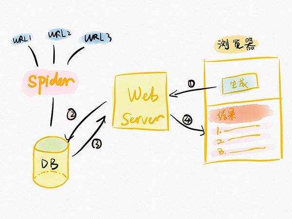

<p align="center">
<a href="http://bg.huaxinlab.cn/">
    
</a>
</p>
<h1 align="center">Briefing Generator</h1>
<p align="center">简报生成器: 一个生成简报的工具</p>
<p align="center">
    <a href="https://acusp.info">
        
    </a>
    <a href="https://github.com/scrapy/scrapy">
        
    </a>
    <a href="https://github.com/tornadoweb/tornado">
        
    </a>
    <a href="http://bg.huaxinlab.cn/">
        
    </a>
    <a href="LICENSE">
        
    </a>
</p>

## 介绍

一个自动生成简报的工具，可自动抓取并分类整理信息，最终按天提供简报内容。

主要是为运营相关人员提供的快速生成每日自定义简报的工具，可节省用户的时间，提高他们的工作效率。

目标用户每天会手动整理简报信息并发布至其它社交平台。「简报生成器」这个产品可以替代用户手动整理信息的繁琐步骤，帮助用户快速生成简报。

如果你对这个产品感兴趣，可以查看有关它的来龙去脉及设计历程的系列文章：[《一个项目带你走进产品经理的世界》](http://www.woshipm.com/pmd/2182811.html)



## 功能列表

**支持的信息源**

- [x] [Next](http://next.36kr.com/posts?sort=hot)

- [x] [知晓程序](https://minapp.com/miniapp/)

- [ ] [Readhub](https://readhub.cn/topics)


**产品形态**

- [x] Web

- [ ] 小程序


**Web 界面功能列表**

- [x] 按用户设置在界面展示生成后的简报

- [ ] 一键复制

- [ ] 选择简报样式

- [ ] 订阅简报（定时发送每日简报）


## 部署(Ubuntu)

> TODO: 自动脚本

**克隆项目**

```
cd ~
git clone https://github.com/HuaxinLab/briefing-generator.git
```

**安装依赖**

需要安装 python3 与 pip3。

```
cd briefing-generator
pip3 install -r requirements.txt
```

**MongoDB**

```
# MacOS 安装 mongodb
sudo brew install mongodb

# ubuntu 安装 mongodb
sudo apt install -y mongodb

# 创建数据库目录
sudo mkdir -p /data/db
sudo chown -R `id -un` /data/db

# 运行
mongod
```

**运行爬虫**

```
mkdir ~/log
chomd +x ~/briefing-generator/BgSpider/cron_task.sh

crontab -e

# 设置爬虫执行的时间: 下面表示每隔 4 小时运行一次
* */4 * * *  ~/briefing-generator/cron_task.sh

# 打开 crontab 日志(可选)
vim /etc/rsyslog.d/50-default.conf 

cron.*                         /var/log/cron.log
```

**运行web server**

```
cd BgServer
python3 generator.py
```

脚步执行成功后，浏览器访问 http://localhost:8001 即可使用。